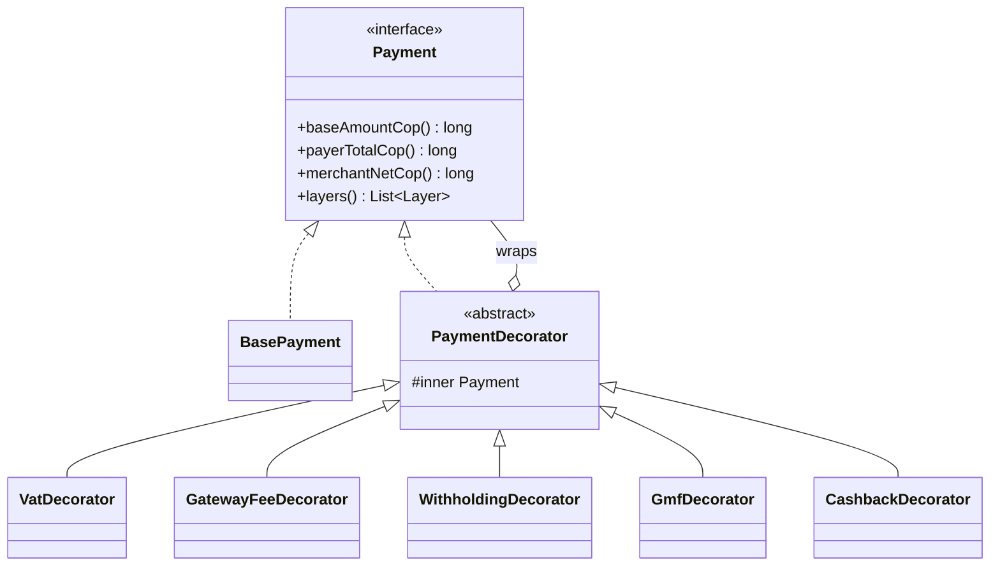

# Colombian Payments Decorator

See exactly what a Colombian payment costs the payer and what the merchant really receives, one layer at a time.

A base payment is wrapped by one **decorator** per concept: VAT, gateway fee, withholding, the 4x1000 tax (GMF)
and cashback. Each layer adds a line to the breakdown and moves one of two totals. The result is a stack you can read
from the base outward, which is the Decorator pattern made visible.

> Academic demo for a Software Patterns course. The rates are simplified demo values, not tax advice.

## Why Decorator fits

Real payments mix charges that depend on the buyer, the merchant and the amount. Writing every combination as a
subclass or a giant `if` block does not scale. With Decorator, each rule is a small class, any subset can be stacked,
and adding a new charge touches no existing code.



## The layers

Wrapping order is fixed, innermost to outermost, so the result never depends on the order of the request.

| # | Option | Rule | Who bears it |
|---|---|---|---|
| 1 | `VAT` | +19% of the base amount | Payer pays more |
| 2 | `GATEWAY_FEE` | -(2.65% of the base + 900 COP) | Merchant receives less |
| 3 | `WITHHOLDING` | -2.5% of the base, only from 27 UVT | Merchant receives less |
| 4 | `GMF` | +0.4% of everything the payer owes so far (base + VAT) | Payer pays more |
| 5 | `CASHBACK` | -1% of the base, capped at 20,000 COP | Payer pays less |

`GMF` is order dependent on purpose: it taxes the amount accumulated by the inner layers, which shows why wrapping
order matters in this pattern.

### Worked example

Base amount 2,000,000 COP with all five options:

| Layer | Amount (COP) |
|---|---|
| Base | 2,000,000 |
| VAT | +380,000 |
| Gateway fee | -53,900 |
| Withholding | -50,000 |
| GMF (0.4% of 2,380,000) | +9,520 |
| Cashback | -20,000 |
| **Payer pays** | **2,369,520** |
| **Merchant receives** | **1,896,100** |

## Custom decorators at annotation level

- **`@ValidNit`** validates a Colombian NIT with the DIAN check digit algorithm (weights `3, 7, 13, 17, 19, 23, 29,
  37, 41, 43, 47, 53, 59, 67, 71`, modulo 11).
- **`@Idempotent`** protects payment creation with an `Idempotency-Key` header. Repeating the same request returns the
  stored response and charges nothing twice; reusing the key with a different body is a `409`.
- **`@SafeText`** rejects input that looks like SQL injection.

## Architecture

```
backend/    Spring Boot 3.3, Java 21, hexagonal layout (domain, application, infrastructure)
frontend/   Vite + React + TypeScript + Tailwind CSS v4
docs/specs/ design and API contract, the source of truth for both sides
```

Authentication is a JWT valid for 24 hours. Demo user: `demo` / `demo123`.

## API

| Method | Path | Purpose |
|---|---|---|
| POST | `/api/v1/auth/login` | Get a token |
| GET | `/api/v1/options` | The five options with their rules |
| POST | `/api/v1/payments/quote` | Price a payment without creating it |
| POST | `/api/v1/payments` | Create a payment (requires `Idempotency-Key`) |
| GET | `/api/v1/payments` | List created payments, newest first |

Errors always look like `{ "error": "VALIDATION", "message": "..." }`. Full contract in
[`docs/specs/design.md`](docs/specs/design.md).

## Run it

Requires Java 21, Maven and Node 20+.

```bash
# backend, http://localhost:8080
cd backend
mvn test
mvn spring-boot:run

# frontend, http://localhost:5173 (second terminal)
cd frontend
npm install
npm run dev
```

The frontend signs in automatically. Set `VITE_API_URL` if the backend runs somewhere else.

## Status

- [x] Repo, design spec and backend infrastructure (JWT, CORS, error handling)
- [ ] Backend: decorators, services, endpoints, annotations, tests
- [ ] Frontend: payment form, layer stack, history
