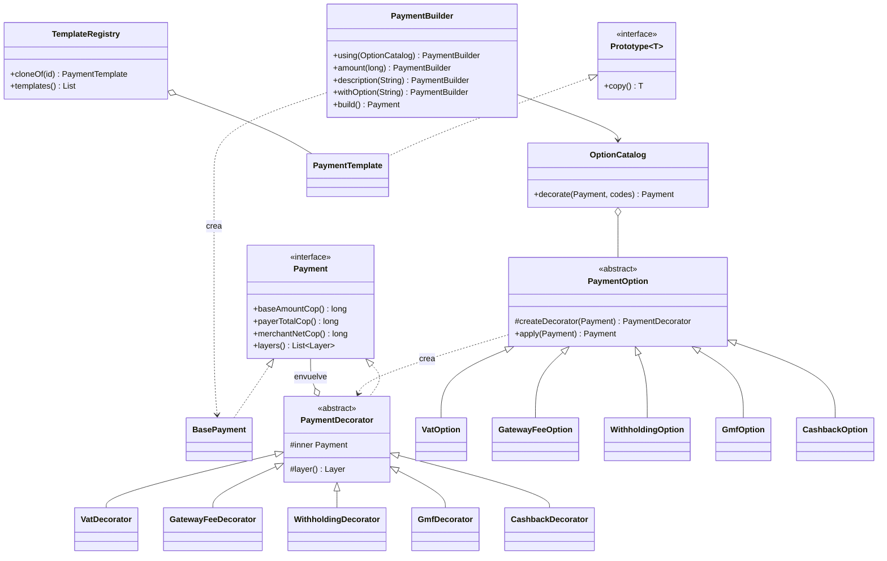

# Pagos en Colombia por capas

Calculadora que muestra cuánto paga el comprador y cuánto recibe realmente el comercio en un pago en Colombia, capa por capa.

🔗 **Aplicación desplegada:** https://santiago425.github.io/Patrones_Decorater_siguientegrupo/  
📁 **Repositorio:** https://github.com/Santiago425/Patrones_Decorater_siguientegrupo

> Proyecto académico de la materia **Patrones de Software** (Universidad Cooperativa de Colombia). Las tarifas son valores simplificados de demostración, no asesoría tributaria.

---

## Contexto

Este proyecto lo recibimos de otro equipo como parte del intercambio de proyectos de la clase. Ellos dejaron listo el dominio con el patrón **Decorator**, la seguridad con JWT y la estructura del frontend, pero faltaban los endpoints de pagos, las anotaciones `@ValidNit` e `@Idempotent` y toda la interfaz.

Nosotros terminamos lo que faltaba, agregamos los patrones **Builder**, **Factory Method** y **Prototype**, pasamos la interfaz a español y lo desplegamos en GitHub Pages.

## Caso de estudio

Un pago real en Colombia mezcla cargos que dependen del comprador, del comercio y del monto: IVA, comisión de la pasarela, retención en la fuente, 4x1000 y a veces un cashback. Si cada combinación fuera una subclase o un `if` gigante, el código no escalaría.

La app parte de un **pago base** y lo envuelve con una capa por cada concepto. Cada capa agrega una línea al detalle y mueve uno de los dos totales: lo que paga el comprador o lo que recibe el comercio.

---

## Patrones aplicados

| Patrón | Tipo | Dónde está | Para qué lo usamos |
|---|---|---|---|
| **Decorator** | Estructural | `PaymentDecorator` y los 5 decoradores | Cada cargo o crédito envuelve al pago y agrega una sola capa. |
| **Factory Method** | Creacional | `PaymentOption.createDecorator()` | Cada opción decide qué decorador crear, sin que el catálogo conozca las clases concretas. |
| **Builder** | Creacional | `PaymentBuilder` | Arma el pago paso a paso (valor, descripción, opciones) y lo valida al final con `build()`. |
| **Prototype** | Creacional | `PaymentTemplate` y `TemplateRegistry` | Las plantillas de pago se clonan; el clon se puede modificar sin tocar la original. |

Los cuatro patrones están implementados igual en el **backend (Java)** y en el **frontend (TypeScript)**, para que la página publicada funcione sola en el navegador.

### 1. Decorator

`Payment` es la interfaz común. `BasePayment` es el pago sin cargos y `PaymentDecorator` es la clase abstracta que guarda el pago envuelto y le delega las llamadas. Cada decorador concreto solo calcula su capa:

```java
Payment payment = new CashbackDecorator(
        new GmfDecorator(
                new VatDecorator(
                        new BasePayment(2_000_000L, "Tenis"))));

payment.payerTotalCop();
payment.merchantNetCop();
payment.layers();
```

### 2. Factory Method

`PaymentOption` es el **creador abstracto**. Define el método fábrica `createDecorator()` y cada opción concreta lo implementa devolviendo su decorador. El método `apply()` es el que usa el catálogo y no sabe qué clase se va a crear.

```java
public abstract class PaymentOption {

    protected abstract PaymentDecorator createDecorator(Payment inner);

    public final Payment apply(Payment inner) {
        return createDecorator(Objects.requireNonNull(inner, "inner payment is required"));
    }
}

public class VatOption extends PaymentOption {

    @Override
    protected PaymentDecorator createDecorator(Payment inner) {
        return new VatDecorator(inner);
    }
}
```

Para agregar un cargo nuevo solo se crea su decorador y su opción; el catálogo y el servicio no cambian.

### 3. Builder

Antes el servicio armaba el pago llamando directamente al catálogo. Ahora `PaymentBuilder` se encarga de construirlo paso a paso, ignora opciones repetidas y valida todo en `build()`:

```java
Payment payment = PaymentBuilder.using(catalog)
        .amount(2_000_000L)
        .description("Factura de consultoría")
        .withOption("VAT")
        .withOption("GATEWAY_FEE")
        .withOption("GMF")
        .build();
```

`PaymentService` usa el builder para cotizar y crear pagos.

### 4. Prototype

`PaymentTemplate` implementa `Prototype` con el método `copy()` en Java y `clone()` en TypeScript. `TemplateRegistry` guarda los prototipos y siempre entrega un clon, así que modificar una plantilla en la pantalla nunca cambia la original.

```java
PaymentTemplate draft = registry.cloneOf("retail-sale")
        .withAmount(999_000L)
        .addOption("CASHBACK");
```

Plantillas que trae la app:

| Plantilla | Valor | Opciones |
|---|---|---|
| Venta en tienda | $150.000 | IVA, comisión, GMF |
| Servicio profesional | $2.000.000 | IVA, comisión, retención, GMF |
| Compra con cashback | $350.000 | IVA, comisión, cashback |

En la interfaz, el botón **Duplicar** del historial también usa Prototype: toma un pago anterior como prototipo y lo clona en el formulario.

---

## Diagrama de clases



---

## Las capas

El orden en que se envuelve es fijo (de adentro hacia afuera), así el resultado no depende del orden en que se pidan las opciones.

| # | Opción | Regla | Quién la asume |
|---|---|---|---|
| 1 | `VAT` (IVA) | +19% del valor base | El comprador paga más |
| 2 | `GATEWAY_FEE` (comisión) | -(2,65% del valor base + $900) | El comercio recibe menos |
| 3 | `WITHHOLDING` (retención) | -2,5% del valor base, solo desde 27 UVT | El comercio recibe menos |
| 4 | `GMF` (4x1000) | +0,4% de lo que lleva acumulado el comprador (base + IVA) | El comprador paga más |
| 5 | `CASHBACK` | -1% del valor base, máximo $20.000 | El comprador paga menos |

El `GMF` depende del orden a propósito: cobra sobre lo que acumularon las capas internas, y eso muestra por qué el orden importa en este patrón.

### Ejemplo

Valor base $2.000.000 con las cinco opciones:

| Capa | Valor (COP) |
|---|---|
| Base | 2.000.000 |
| IVA | +380.000 |
| Comisión de la pasarela | -53.900 |
| Retención en la fuente | -50.000 |
| GMF (0,4% de 2.380.000) | +9.520 |
| Cashback | -20.000 |
| **Paga el comprador** | **2.369.520** |
| **Recibe el comercio** | **1.896.100** |

---

## Funcionalidades de la interfaz

- Plantillas de pago que se clonan con un clic (Prototype).
- Formulario con valor en pesos formateado en vivo, NIT con validación del dígito de verificación de la DIAN, descripción y las cinco opciones con su regla.
- Cotización en vivo como una pila de capas, coloreadas según quién asume el cargo, con los totales de comprador y comercio.
- Panel **"Patrones en acción"** que muestra, para la cotización actual, el clon de la plantilla, los pasos del Builder, qué decorador creó cada Factory Method y la cadena de decoradores.
- Botón **Pagar** y **Reintentar el mismo pago**, que reenvía la misma llave de idempotencia y muestra que no se cobró dos veces.
- Historial de pagos con opción de **Duplicar**.
- Diseño responsive.

## Anotaciones personalizadas (backend)

- **`@ValidNit`**: valida el NIT colombiano con el algoritmo de la DIAN (pesos `3, 7, 13, 17, 19, 23, 29, 37, 41, 43, 47, 53, 59, 67, 71`, módulo 11).
- **`@Idempotent`**: protege la creación de pagos con el encabezado `Idempotency-Key`. Si se repite la misma petición devuelve la respuesta guardada con `Idempotent-Replayed: true`; si se usa la misma llave con otro cuerpo responde `409`.
- **`@SafeText`**: rechaza textos con forma de inyección SQL.

---

## Arquitectura

```
backend/             Spring Boot 3.3, Java 21, arquitectura hexagonal (domain, application, infrastructure)
  domain/            Payment, decoradores, option (Factory Method), builder, prototype
  application/       PaymentService
  infrastructure/    controladores REST, JWT, CORS, validaciones e idempotencia
frontend/            Vite + React + TypeScript + Tailwind CSS v4
  src/domain/        el mismo dominio y los mismos patrones en TypeScript
  src/services/      gateway local (navegador) o gateway HTTP (backend)
docs/specs/          diseño y contrato de la API del equipo original
.github/workflows/   despliegue automático del frontend en GitHub Pages
```

El frontend decide cómo calcular según la variable `VITE_API_URL`:

- **Sin `VITE_API_URL`** (así está publicado): usa el dominio en TypeScript dentro del navegador.
- **Con `VITE_API_URL`**: llama al backend de Spring Boot.

## API del backend

Autenticación con JWT válido por 24 horas. Usuario de prueba: `demo` / `demo123`.

| Método | Ruta | Para qué |
|---|---|---|
| POST | `/api/v1/auth/login` | Obtener el token |
| GET | `/api/v1/options` | Las cinco opciones con su regla |
| GET | `/api/v1/templates` | Las plantillas de pago (Prototype) |
| GET | `/api/v1/templates/{id}` | Un clon de una plantilla |
| POST | `/api/v1/payments/quote` | Cotizar un pago sin crearlo |
| POST | `/api/v1/payments` | Crear un pago (requiere `Idempotency-Key`) |
| GET | `/api/v1/payments` | Listar los pagos, el más reciente primero |

Los errores siempre tienen la forma `{ "error": "VALIDATION", "message": "..." }`.

---

## Cómo ejecutarlo

Requiere Java 21, Maven y Node 20 o superior.

**Solo el frontend (modo demostración):**

```bash
cd frontend
npm install
npm run dev
```

Abrir http://localhost:5173

**Backend y frontend juntos:**

```bash
# backend, http://localhost:8080
cd backend
mvn test
mvn spring-boot:run

# frontend (en otra terminal)
cd frontend
npm install
VITE_API_URL=http://localhost:8080 npm run dev
```

En Windows (PowerShell) la última línea es:

```powershell
$env:VITE_API_URL="http://localhost:8080"; npm run dev
```

## Despliegue

El frontend se despliega solo con **GitHub Actions** cada vez que se hace push a `main` (`.github/workflows/deploy-frontend.yml`). El flujo instala dependencias, ejecuta `npm run build` y publica la carpeta `frontend/dist` en GitHub Pages.

Para activarlo en el repositorio: *Settings* → *Pages* → *Source*: **GitHub Actions**.

## Pruebas

En el backend hay pruebas con JUnit 5 para cada decorador, el ejemplo completo, el catálogo y el servicio. Nosotros agregamos:

- `PaymentBuilderTest`: construcción paso a paso, opciones repetidas y validaciones.
- `PaymentOptionFactoryTest`: cada opción crea su decorador.
- `TemplateRegistryTest`: los clones son objetos nuevos y modificarlos no cambia el prototipo.
- `ValidNitValidatorTest`: NIT válidos e inválidos.

```bash
cd backend
mvn test
```

## Créditos

- **Equipo original:** dominio con Decorator, seguridad con JWT, contrato de la API y base del frontend.
- **Nuestro equipo:** Builder, Factory Method y Prototype; endpoints de pagos y plantillas; `@ValidNit` e `@Idempotent`; interfaz completa en español y despliegue en GitHub Pages.
